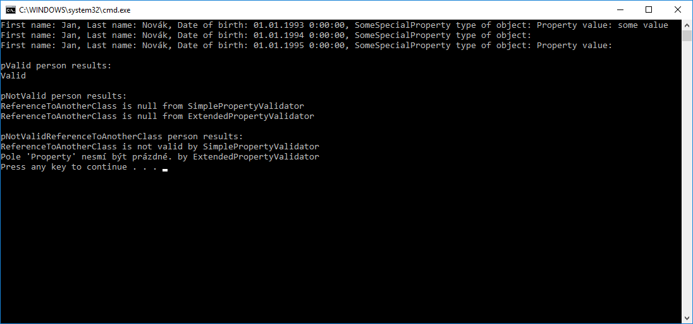

# Konzolová aplikace ukazující použití Fluent Validation
Fluent validace je typ zápisu, kdy metoda vrací instanci objektu, ve které se nachází.

```csharp
RuleFor(person => person.LastName)
    .NotEmpty()
    .NotNull()
    .NotEqual(person => person.FirstName)
    .WithMessage("First name and last name could not be same");
```


